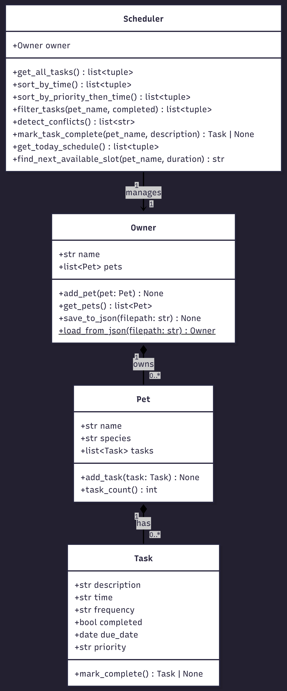

# PawPal+ (Module 2 Project)

**PawPal+** is a Streamlit-powered pet care planning assistant that helps busy pet owners stay on top of daily tasks like walks, feeding, medication, grooming, and enrichment.

## 📸 Demo

<a href="/pawpal_demo.png" target="_blank"></a>

## ✨ Features

- **Add pets & tasks** — Register multiple pets (dogs, cats, or other) and assign care tasks with a time, priority level, and frequency.
- **Sort by time** — View tasks in chronological order using `Scheduler.sort_by_time()`, even when tasks are added out of order.
- **Sort by priority → time** — Group tasks by priority (high → medium → low), then sort within each group by time using `Scheduler.sort_by_priority_then_time()`.
- **Filter by pet or status** — Narrow the task list to a specific pet or show only incomplete tasks using `Scheduler.filter_tasks()`.
- **Conflict detection** — Automatically warns when two tasks are scheduled at the exact same time via `Scheduler.detect_conflicts()`, displayed prominently as Streamlit warnings.
- **Recurring task automation** — When a daily or weekly task is marked complete, a new task is auto-created for the next occurrence (using `timedelta`), so routine tasks never need re-entry.
- **Find next available slot** — `Scheduler.find_next_available_slot()` suggests an open time for a new task based on existing schedule gaps.
- **JSON persistence** — Save and load owner/pet/task data with `Owner.save_to_json()` and `Owner.load_from_json()`.

## 🏗️ Architecture

The system uses four classes:

| Class | Responsibility |
|-------|----------------|
| **Task** | Dataclass representing a single care activity with time, priority, frequency, and completion status. |
| **Pet** | Dataclass representing a pet that owns a list of Tasks. |
| **Owner** | Manages a collection of Pets and handles JSON persistence. |
| **Scheduler** | Orchestrates sorting, filtering, conflict detection, recurrence, and schedule generation across all pets. |



## 🧪 Testing

Run the test suite (18 tests):

```bash
python -m pytest -v
```

Tests cover: task completion, sorting correctness, daily/weekly recurrence, single & multiple conflict detection, filtering by pet/status, and edge cases (empty pets, nonexistent tasks).

**Confidence Level:** ⭐⭐⭐⭐⭐ (5/5) — All 18 tests pass.

## 🚀 Getting Started

### Setup

```bash
python -m venv .venv
source .venv/bin/activate  # Windows: .venv\Scripts\activate
pip install -r requirements.txt
```

### Run the app

```bash
streamlit run app.py
```
