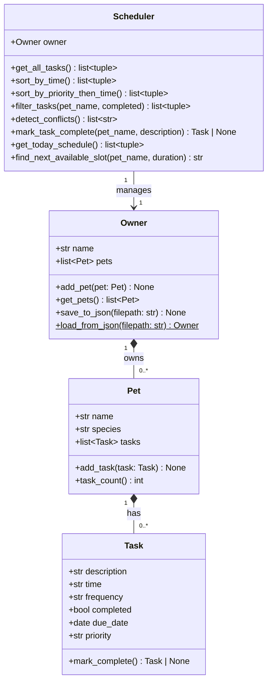

# PawPal+ Final UML Class Diagram

```mermaid
classDiagram
    class Task {
        +str description
        +str time
        +str frequency
        +bool completed
        +date due_date
        +str priority
        +mark_complete() Task | None
    }

    class Pet {
        +str name
        +str species
        +list~Task~ tasks
        +add_task(task: Task) None
        +task_count() int
    }

    class Owner {
        +str name
        +list~Pet~ pets
        +add_pet(pet: Pet) None
        +get_pets() list~Pet~
        +save_to_json(filepath: str) None
        +load_from_json(filepath: str)$ Owner
    }

    class Scheduler {
        +Owner owner
        +get_all_tasks() list~tuple~
        +sort_by_time() list~tuple~
        +sort_by_priority_then_time() list~tuple~
        +filter_tasks(pet_name, completed) list~tuple~
        +detect_conflicts() list~str~
        +mark_task_complete(pet_name, description) Task | None
        +get_today_schedule() list~tuple~
        +find_next_available_slot(pet_name, duration) str
    }

    Owner "1" *-- "0..*" Pet : owns
    Pet "1" *-- "0..*" Task : has
    Scheduler "1" --> "1" Owner : manages
```
